# 大型露天铁矿网络拓扑架构图 (Simandou铁矿模式)

## 整体网络架构图

```mermaid
graph TB
    %% 外部连接
    Internet[互联网/卫星通信]
    RailwayNet[铁路运输网络]
    PortNet[港口网络系统]
    
    %% 矿区总部网络中心
    subgraph "矿区总部网络中心"
        HQCoreSwitch1[总部核心交换机1]
        HQCoreSwitch2[总部核心交换机2]
        HQFirewall[防火墙/边界路由器]
        ProductionServer[生产管理服务器]
        SafetyServer[安全监控服务器]
        EnvServer[环境监测服务器]
        MaintenanceServer[设备维护管理服务器]
        HRServer[人力资源系统]
        FinanceServer[财务管理系统]
        DataCenter[数据中心/云平台]
        BackupSystem[备份系统]
        GPSServer[GPS/GIS服务器]
    end
    
    %% 采矿区域网络
    subgraph "露天采矿区网络"
        MiningAreaRouter[采矿区路由器]
        WirelessAP1[无线接入点1-北区]
        WirelessAP2[无线接入点2-中区] 
        WirelessAP3[无线接入点3-南区]
        DrillRig1[钻机1网络终端]
        DrillRig2[钻机2网络终端]
        Excavator1[挖掘机1车载终端]
        Excavator2[挖掘机2车载终端]
        Excavator3[挖掘机3车载终端]
        Truck1[重型卡车1车载终端]
        Truck2[重型卡车2车载终端]
        TruckN[重型卡车...n车载终端]
        BlastController[爆破控制系统]
        WeatherStation[气象监测站]
    end
    
    %% 选矿厂网络
    subgraph "选矿厂网络系统"
        PlantCoreSwitch[选矿厂核心交换机]
        PrimaryCrusher[一级破碎机控制]
        SecondaryCrusher[二级破碎机控制]
        ScreeningEquip[筛分设备网络]
        ConveyorSystem[输送带系统网络]
        StockpileSystem[堆场管理系统]
        WaterTreatment[水处理系统]
        DustSuppression[抑尘系统]
        QualityControl[质量检测系统]
        LoadingSystem[装车系统]
    end
    
    %% 运输系统网络
    subgraph "运输系统网络"
        TransportRouter[运输系统路由器]
        RailwayControl[铁路调度控制]
        TrainLoading[火车装载系统]
        ConveyorBackbone[长距离输送带网络]
        WasteManagement[废料管理系统]
        RoadMaintenance[道路维护系统]
        FuelStation[加油站管理]
        MaintenanceDepot[设备维修车间]
    end
    
    %% 基础设施网络
    subgraph "基础设施网络"
        InfraRouter[基础设施路由器]
        PowerSubstation[变电站监控]
        WaterSupply[供水系统]
        SewageTreatment[污水处理]
        EmergencyServices[应急服务中心]
        SecuritySystem[安保监控系统]
        PerimeterSecurity[周界安防]
        AccessControl[门禁控制系统]
    end
    
    %% 通信与监控
    subgraph "通信监控网络"
        CommCenter[通信调度中心]
        RadioTower[无线电基站]
        SatelliteComm[卫星通信站]
        CCTV[视频监控系统]
        GPSTracking[GPS车辆跟踪]
        EnvironmentalMonitor[环境监测网络]
        WeightBridge[地磅系统]
        TimeAttendance[考勤系统]
    end
    
    %% 连接关系
    Internet --> HQFirewall
    RailwayNet --> TransportRouter
    PortNet --> TransportRouter
    
    HQFirewall --> HQCoreSwitch1
    HQFirewall --> HQCoreSwitch2
    HQCoreSwitch1 -.冗余链路.- HQCoreSwitch2
    
    HQCoreSwitch1 --> ProductionServer
    HQCoreSwitch1 --> SafetyServer
    HQCoreSwitch1 --> EnvServer
    HQCoreSwitch1 --> MaintenanceServer
    HQCoreSwitch1 --> HRServer
    HQCoreSwitch1 --> FinanceServer
    HQCoreSwitch1 --> DataCenter
    HQCoreSwitch1 --> BackupSystem
    HQCoreSwitch1 --> GPSServer
    
    HQCoreSwitch1 -.光纤主干.- MiningAreaRouter
    HQCoreSwitch1 -.光纤主干.- PlantCoreSwitch
    HQCoreSwitch1 -.光纤主干.- TransportRouter
    HQCoreSwitch1 -.光纤主干.- InfraRouter
    HQCoreSwitch1 -.光纤主干.- CommCenter
    
    MiningAreaRouter --> WirelessAP1
    MiningAreaRouter --> WirelessAP2
    MiningAreaRouter --> WirelessAP3
    MiningAreaRouter --> DrillRig1
    MiningAreaRouter --> DrillRig2
    MiningAreaRouter --> BlastController
    MiningAreaRouter --> WeatherStation
    
    WirelessAP1 -.无线.- Excavator1
    WirelessAP1 -.无线.- Truck1
    WirelessAP2 -.无线.- Excavator2
    WirelessAP2 -.无线.- Truck2
    WirelessAP3 -.无线.- Excavator3
    WirelessAP3 -.无线.- TruckN
    
    PlantCoreSwitch --> PrimaryCrusher
    PlantCoreSwitch --> SecondaryCrusher
    PlantCoreSwitch --> ScreeningEquip
    PlantCoreSwitch --> ConveyorSystem
    PlantCoreSwitch --> StockpileSystem
    PlantCoreSwitch --> WaterTreatment
    PlantCoreSwitch --> DustSuppression
    PlantCoreSwitch --> QualityControl
    PlantCoreSwitch --> LoadingSystem
    
    TransportRouter --> RailwayControl
    TransportRouter --> TrainLoading
    TransportRouter --> ConveyorBackbone
    TransportRouter --> WasteManagement
    TransportRouter --> RoadMaintenance
    TransportRouter --> FuelStation
    TransportRouter --> MaintenanceDepot
    
    InfraRouter --> PowerSubstation
    InfraRouter --> WaterSupply
    InfraRouter --> SewageTreatment
    InfraRouter --> EmergencyServices
    InfraRouter --> SecuritySystem
    InfraRouter --> PerimeterSecurity
    InfraRouter --> AccessControl
    
    CommCenter --> RadioTower
    CommCenter --> SatelliteComm
    CommCenter --> CCTV
    CommCenter --> GPSTracking
    CommCenter --> EnvironmentalMonitor
    CommCenter --> WeightBridge
    CommCenter --> TimeAttendance
```

## 重型移动设备网络架构

## 选矿厂自动化网络

## 安全环境监控网络

## 网络技术规格说明

### 网络基础设施
- **主干网络**: 万兆光纤环网，支持OSPF/BGP路由协议
- **无线覆盖**: 4G/5G专网，WiFi 6覆盖关键区域
- **卫星通信**: 备用链路，支持远程区域连接
- **网络冗余**: 双链路设计，99.9%可用性

### 移动设备通信
- **车载终端**: 工业级车载路由器，IP67防护
- **定位精度**: RTK-GPS，精度±2cm
- **通信协议**: LTE-M/NB-IoT用于设备监控
- **数据传输**: 实时位置、设备状态、作业数据

### 工业控制网络
- **DCS系统**: 分布式控制，冗余配置
- **现场总线**: Profinet/Modbus/CAN总线
- **实时性要求**: 控制网络延迟<10ms
- **安全隔离**: 生产网络与管理网络物理隔离

### 安全与监控
- **视频系统**: 4K高清监控，智能分析
- **环境监测**: 实时PM2.5、噪音、振动监测
- **人员定位**: UWB高精度定位，±30cm
- **应急通信**: 独立应急网络，卫星备份

### 数据管理
- **数据中心**: 私有云+边缘计算架构
- **存储系统**: 分布式存储，3副本备份
- **数据分析**: 大数据平台，AI智能分析
- **接口标准**: REST API，OPC-UA工业协议

### 网络安全
- **边界防护**: 下一代防火墙，IPS入侵防护
- **访问控制**: 基于角色的访问控制(RBAC)
- **数据加密**: AES-256数据传输加密
- **安全审计**: 24/7安全运营中心(SOC)

---

**项目特点**: 基于Simandou铁矿规模的网络架构，支持2.7Gt储量的大型露天开采作业，覆盖面积738km²，支持数百台重型设备和数千名员工的安全高效作业。
